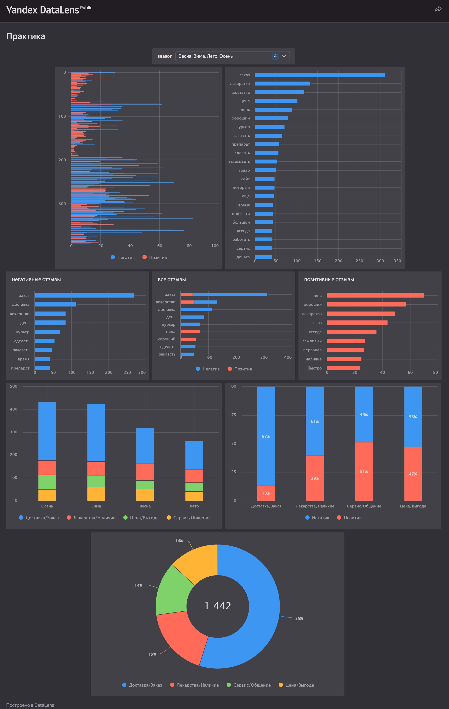

# 18 - Группа

# Визуализация и лексический анализ отзывов (Аптеки, Санкт-Петербург)   Номер команды - 18.

Этот проект посвящен изучению отзывов пользователей Яндекс Карт на сети аптек. Основная цель — с помощью методов обработки естественного языка (NLP) выделить ключевые тематические акценты, оценить тональность высказываний и визуализировать результаты для поиска «болевых точек» бизнеса.

Для визуализации и построения дашборда использовался инструмент **Yandex DataLens**.

https://datalens.yandex/lce319u12c565



*Общий вид аналитической панели в Yandex DataLens.
Интерактивная панель позволяет фильтровать данные по сезонам.*

## Структура проекта

```text
Project/
├── BD/
│   ├── data/
│   │   ├── yandex_reviews_clean.csv      # Исходный файл с отзывами
│   │   ├── 1_reviews_full_cleaned.csv    # Очищенные данные с леммами и сезонами
│   │   └── datalens_ready.csv            # Денормализованный датасет для Yandex DataLens
│   └── dictionaries/
│       ├── 5_topics_config.json          # Конфигурация тематических категорий
│       ├── 2_stats_general.csv           # Частотный словарь (общий)
│       ├── 3_stats_positive.csv          # Частотный словарь (позитив)
│       └── 4_stats_negative.csv          # Частотный словарь (негатив)
├── notebooks/
│   └── analysis_pipeline.ipynb       # Jupyter Notebook с кодом обработки
├── img/
│   ├── dashboard_main.png            # Дашборд  из Yandex DataLens
│   ├── chart_1.png
│   ├── chart_2.png
│   ├── chart_3.png
│   ├── chart_4.png
│   ├── chart_5.png
│   ├── chart_6.png
│   ├── chart_7.png
│   └── chart_8.png
├── itog.pptx                         # Отчет о проекте
└── README.md
```

## Требования

Для запуска кода обработки данных рекомендуется использовать Python 3.8+.

**Основные библиотеки:**
*   `pandas` — работа с табличными данными.
*   `pymorphy2` — лемматизация (приведение слов к начальной форме) русского языка.

## Сбор данных

Исходный набор данных был сформирован путем автоматизированного сбора (парсинга) общедоступной информации с платформы Яндекс Карты.

### Техническая реализация
Сбор данных осуществлялся с использованием языка **Python** и библиотеки для автоматизации браузера **Playwright** . Данный подход позволяет корректно обрабатывать динамический контент, который подгружается через JavaScript.

### Алгоритм работы парсера:
1.  **Инициализация:** Запуск экземпляра браузера в режиме *headless* (без графического интерфейса).
2.  **Навигация:** Переход на страницу карточки организации (раздел «Отзывы»).
3.  **Обработка "Бесконечной прокрутки" (Infinite Scroll):**
    *   Яндекс Карты не загружают все отзывы сразу. Скрипт эмулирует прокрутку боковой панели вниз.
    *   Ожидание подгрузки новых элементов (Network Idle state).
    *   Повторение цикла до тех пор, пока не будут загружены все доступные отзывы или не сработает лимит (например, 600 отзывов).
4.  **Извлечение данных (HTML Parsing):**
    *   Для каждого контейнера отзыва (`.business-review-view`) извлекались следующие поля через CSS-селекторы:
        *   **Автор:** Имя пользователя.
        *   **Дата:** Строковое значение (относительное или абсолютное).
        *   **Рейтинг:** Количество закрашенных звезд (ширина элемента в %).
        *   **Текст:** Тело отзыва (с разворачиванием кнопки «Читать далее»).
5.  **Экспорт:** Сохранение собранных объектов в структурированный файл CSV с кодировкой UTF-8.

## Процесс обработки

Весь процесс анализа разделен на 4 этапа:

1.  **Предобработка данных:**
    *   Парсинг дат из формата «9 декабря 2025» в `datetime`.
    *   Определение сезона (Зима/Весна/Лето/Осень) по месяцу отзыва.
    *   Очистка от пустых строк и дубликатов.

2.  **NLP Pipeline (Обработка текста):**
    *   **Токенизация:** Разбиение текста на слова, удаление пунктуации и цифр.
    *   **Лемматизация:** Приведение слов к словарной форме (например, *«аптеки»* $\rightarrow$ *«аптека»*) с помощью `pymorphy2`.
    *   **Фильтрация:** Удаление стоп-слов (*«и», «в», «мне»*) и специфического мусора (*«это», «всё», «мочь»*).

3.  **Категоризация:**
    *   На основе частотного анализа выделены 4 ключевые темы:
        *   `Доставка/Заказ` (*заказ, курьер, привезти*)
        *   `Цена/Выгода` (*цена, скидка, дорого*)
        *   `Лекарства/Наличие` (*препарат, таблетки, срок*)
        *   `Сервис/Общение` (*хамство, вежливый, персонал*)

4.  **Визуализация:**
    *   Подготовка данных в формате "одна строка — одно слово".
    *   Загрузка в Yandex DataLens и построение интерактивного дашборда.

## Реализованные структуры данных

В ходе выполнения работы были спроектированы и реализованы специальные структуры данных для хранения, обработки и агрегации текстовой информации. Результаты сохранены в виде постоянных артефактов (CSV/JSON).

### 1. Обогащенная таблица
Основная база данных, содержащая полный контекст каждого отзыва.
*   **Структура:** Таблица, где каждая строка — это уникальный отзыв.
*   **Ключевые атрибуты:**
    *   `date_clean`: Дата в формате ISO (для временных рядов).
    *   `season`: Вычисленный сезон (Зима/Весна/Лето/Осень).
    *   `lemmas`: Список (List) очищенных и нормализованных слов.
*   **Файл:** `BD/data/1_reviews_full_cleaned.csv`
*   **Назначение:** Источник истины для детального анализа и проверки гипотез.

### 2. Частотные словари (Counters)
Три агрегированные базы данных, реализованные через структуру `collections.Counter` (Хеш-таблица: `Слово -> Количество`). Позволяют мгновенно получать топы слов без перебора всего массива.
*   **Общая база:** Статистика по всему корпусу текстов. (`BD/dictionaries/2_stats_general.csv`)
*   **Позитивная база:** Лексическое ядро отзывов с рейтингом 4-5. (`BD/dictionaries/3_stats_positive.csv`)
*   **Негативная база:** Лексическое ядро отзывов с рейтингом 1-3. (`BD/dictionaries/4_stats_negative.csv`)
*   **Назначение:** Быстрое построение облаков слов и сравнительный анализ лексики.

### 3. Тематическая база знаний
Словарь категорий, отображающий семантические группы слов на бизнес-процессы.
*   **Структура:** JSON-объект, где Ключ — это Название темы, а Значение — список ключевых слов.
    ```json
    {
      "Доставка/Заказ": ["курьер", "опоздать", "заказ", ...],
      "Цена/Выгода": ["дорого", "скидка", "акция", ...]
    }
    ```
*   **Файл:** `BD/dictionaries/5_topics_config.json`
*   **Назначение:** Кластеризация тысяч разрозненных слов в понятные бизнес-метрики.

### 4. Денормализованный слой для Yandex DataLens
Специализированная структура данных для загрузки в Yandex DataLens.
*   **Трансформация:** Переход от структуры «Один отзыв — Много слов» к структуре «Одна строка — Одно слово».
*   **Атрибуты:** Добавлены вычисляемые поля `sentiment` (Тональность) и `topic` (Категория) для каждой записи.
*   **Файл:** `BD/data/datalens_ready.csv`
*   **Назначение:** Обеспечение работы фильтров и агрегации в BI-системе.

## Результаты анализа

Ниже представлены выводы, сделанные на основе построенных визуализаций.

### 1. Частотный анализ ключевых слов
*   **Абсолютный лидер:** Слово **«заказ»** встречается чаще всего (более 300 упоминаний). Следом идут «лекарство», «доставка» и «цена».
*   **Смещение фокуса:** Пользователи воспринимают аптеку не как физическую точку продаж, а как **сервис доставки**. Лексика, связанная с онлайн-коммерцией («сайт», «приложение», «курьер»), доминирует над лексикой классической аптеки («зал», «чистота», «фармацевт»).

### 2. Сравнение Позитива и Негатива
*   **Драйверы негатива (синие бары):** Основной массив жалоб связан со словами **«заказ»**, **«доставка»**, **«курьер»**. Пользователи недовольны срывами сроков и логистикой.
*   **Драйверы позитива (красные бары):** Клиенты чаще всего хвалят **«цену»** и **«ассортимент»** (наличие редких лекарств). Также в топе позитива слово «хороший» и «вежливый».
*   Одно и то же слово «лекарство» часто встречается и в плюсах (когда нашли редкое), и в минусах (когда не привезли).

### 3. Анализ тематик
Круговая диаграмма и график нормированной тональности показывают критическую картину бизнес-процессов:

*   **Доминирующая тема:** Тема **«Доставка/Заказ»** занимает **55%** от всех упоминаний (1442 слова). Это самое обсуждаемое направление.
*   **Качество процессов (Reputation Profile):**
    *   🔴 **Доставка/Заказ:** Самая проблемная зона. **87% отзывов в этой категории — негативные.** Это «узкое горлышко» бизнеса.
    *   🟡 **Лекарства/Наличие:** 61% негатива (часто связано с тем, что товара не оказалось при сборке заказа).
    *   🟢 **Цена/Выгода:** Относительно сбалансированная категория (47% позитива), что является конкурентным преимуществом.
    *   🟢 **Сервис/Общение:** 51% позитива. Работу персонала в залах и колл-центре оценивают нейтрально-положительно.

### 4. Сезонность
Анализ по сезонам (Осень, Зима, Весна, Лето) показывает стабильную структуру проблем:
*   Доля жалоб на доставку (синий сегмент на столбчатой диаграмме) остается высокой в любое время года.
*   Это указывает на то, что проблемы носят **системный**, а не сезонный характер (не зависят от погоды).

## Выводы

1.  **Основная проблема:** Логистика. Клиенты массово жалуются на отмену заказов или опоздания курьеров. Высокая частотность слова «заказ» в негативном контексте подтверждает это.
2.  **Сильные стороны:** Ценовая политика и широта ассортимента удерживают рейтинг.

## Работу выполнили:
1. Берсанов Тимур
2. Забунков Леонид
3. Бессонов Александр
4. Злотин Ефим
